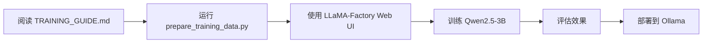

# ReAct 模型训练方案对比

## 📊 训练方法对比

| 特性 | LLaMA-Factory | Unsloth | Axolotl | 手动 HuggingFace |
|------|---------------|---------|---------|------------------|
| **易用性** | ⭐⭐⭐⭐⭐ Web UI | ⭐⭐⭐⭐ 简单API | ⭐⭐⭐ 配置文件 | ⭐⭐ 需要编码 |
| **训练速度** | ⭐⭐⭐ 标准 | ⭐⭐⭐⭐⭐ 最快 | ⭐⭐⭐⭐ 很快 | ⭐⭐⭐ 标准 |
| **显存占用** | ⭐⭐⭐⭐ 较低 | ⭐⭐⭐⭐⭐ 最低 | ⭐⭐⭐ 中等 | ⭐⭐⭐ 中等 |
| **功能完整度** | ⭐⭐⭐⭐⭐ 很全 | ⭐⭐⭐ 基础 | ⭐⭐⭐⭐⭐ 最全 | ⭐⭐⭐⭐ 灵活 |
| **文档质量** | ⭐⭐⭐⭐⭐ 优秀 | ⭐⭐⭐⭐ 良好 | ⭐⭐⭐⭐ 详细 | ⭐⭐⭐⭐⭐ 官方 |
| **社区支持** | ⭐⭐⭐⭐⭐ 活跃 | ⭐⭐⭐⭐ 活跃 | ⭐⭐⭐⭐ 活跃 | ⭐⭐⭐⭐⭐ 最大 |
| **推荐场景** | 新手、快速实验 | 追求速度 | 高级定制 | 深度定制 |

---

## 🎯 模型选择建议

### Qwen 系列（推荐用于 ReAct）

| 模型 | 参数量 | 显存需求 | 训练时间* | 推理速度 | 推荐用途 |
|------|--------|----------|-----------|----------|---------|
| **Qwen2.5-0.5B** | 0.5B | 4GB (LoRA) | ~1h | 很快 | 快速原型 |
| **Qwen2.5-1.5B** | 1.5B | 6GB (LoRA) | ~2h | 快 | 轻量部署 |
| **Qwen2.5-3B** | 3B | 10GB (LoRA) | ~3h | 较快 | 平衡选择 ⭐ |
| **Qwen2.5-7B** | 7B | 16GB (LoRA) | ~6h | 中等 | 性能优先 ⭐⭐ |
| **Qwen2.5-14B** | 14B | 24GB (QLoRA) | ~12h | 较慢 | 最佳性能 |
| **Qwen2.5-Coder-7B** | 7B | 16GB (LoRA) | ~6h | 中等 | 代码推理 ⭐ |

\* 基于 600 个样本，3 个 epoch，RTX 4090

### 其他开源模型对比

| 模型系列 | 优势 | 劣势 | 推荐度 |
|---------|------|------|--------|
| **Qwen2.5** | 中英文平衡，推理能力强 | - | ⭐⭐⭐⭐⭐ |
| **Llama 3** | 社区支持好，工具多 | 中文较弱 | ⭐⭐⭐⭐ |
| **Mistral** | 推理能力强，效率高 | 中文支持少 | ⭐⭐⭐⭐ |
| **Phi-3** | 小而精，部署容易 | 能力有限 | ⭐⭐⭐ |
| **GLM-4** | 中文优秀 | 开源版本较少 | ⭐⭐⭐⭐ |
| **DeepSeek-Coder** | 代码能力强 | 通用能力一般 | ⭐⭐⭐ |

---

## 💰 成本对比

### 云端训练成本（参考价格）

**场景**: 训练 Qwen2.5-7B，600 样本，3 epochs

| 平台 | GPU | 训练时间 | 成本 | 备注 |
|------|-----|---------|------|------|
| **本地 RTX 4090** | 24GB | ~6h | 电费 ~$1 | 一次性投资 |
| **Google Colab Pro** | A100 40GB | ~3h | $10/月 | 有时长限制 |
| **AutoDL** | RTX 4090 | ~6h | ¥30-50 | 按时计费 |
| **AWS SageMaker** | ml.g5.2xlarge | ~6h | $60 | 按需付费 |
| **阿里云 PAI** | A10 | ~6h | ¥50-80 | 按时计费 |

### 推理成本（每月）

| 部署方式 | 成本 | QPS | 优势 | 劣势 |
|---------|------|-----|------|------|
| **本地 Ollama** | 电费 ~$5 | 不限 | 隐私、免费 | 需要硬件 |
| **云端 API** | $50-200 | 中等 | 稳定可靠 | 持续付费 |
| **自建服务器** | $100+ | 高 | 可控性强 | 运维成本 |

---

## 🔧 训练配置推荐

### 入门配置（RTX 3060 12GB）

```yaml
model: Qwen2.5-3B-Instruct
method: QLoRA (4-bit)
batch_size: 1
gradient_accumulation: 16
lora_rank: 8
cutoff_len: 1024
epochs: 3
time: ~3 hours
```

**适合**: 学习、实验、快速迭代

### 标准配置（RTX 4090 24GB）

```yaml
model: Qwen2.5-7B-Instruct
method: LoRA
batch_size: 2
gradient_accumulation: 8
lora_rank: 16
cutoff_len: 2048
epochs: 3
time: ~6 hours
```

**适合**: 生产环境、高质量模型

### 高性能配置（A100 80GB）

```yaml
model: Qwen2.5-14B-Instruct
method: LoRA
batch_size: 4
gradient_accumulation: 4
lora_rank: 32
cutoff_len: 2048
epochs: 3
time: ~8 hours
```

**适合**: 追求最佳效果、研究

---

## 📈 效果预期

### 训练数据量 vs 性能

| 样本数 | 预期效果 | 建议 |
|--------|---------|------|
| 100-300 | 基础能力 | 适合原型验证 |
| 300-600 | 良好表现 | **当前数据量** ⭐ |
| 600-1000 | 优秀表现 | 推荐目标 |
| 1000+ | 接近完美 | 收益递减 |

### 不同模型的性能表现（预估）

基于 ReAct 任务的成功率：

| 模型 | 简单任务 | 中等任务 | 复杂任务 | 平均 |
|------|---------|---------|---------|------|
| **GPT-4** | 95% | 90% | 85% | 90% |
| **Qwen2.5-14B (微调)** | 90% | 80% | 65% | 78% |
| **Qwen2.5-7B (微调)** | 85% | 75% | 55% | 72% |
| **Qwen2.5-3B (微调)** | 75% | 60% | 40% | 58% |
| **Qwen2.5-7B (零样本)** | 60% | 40% | 20% | 40% |

---

## 🎓 学习路径建议

### 新手路径（1-2 周）



**时间**: 2-3 天（包括学习）
**成本**: 低（可用 Colab 免费版）
**收获**: 完整流程经验

### 进阶路径（1 个月）


**时间**: 1-2 周
**成本**: 中（需要较好GPU）
**收获**: 生产级部署能力

### 专家路径（持续）


**时间**: 持续学习
**成本**: 高（需要计算资源）
**收获**: 研究级能力

---

## ✅ 快速决策树

```
需要训练 ReAct 模型？
│
├─ 显存 < 12GB?
│  ├─ Yes → 使用 Qwen2.5-3B + QLoRA + LLaMA-Factory
│  └─ No  → 继续
│
├─ 追求速度?
│  ├─ Yes → 使用 Unsloth + Qwen2.5-7B
│  └─ No  → 继续
│
├─ 第一次训练?
│  ├─ Yes → 使用 LLaMA-Factory Web UI
│  └─ No  → 继续
│
├─ 需要定制功能?
│  ├─ Yes → 使用 Axolotl
│  └─ No  → 使用 LLaMA-Factory 命令行
│
└─ 预算充足?
   ├─ Yes → 训练 Qwen2.5-14B
   └─ No  → 训练 Qwen2.5-7B
```

---

## 🚀 立即开始

### 最快路径（30 分钟上手）

```bash
# 1. 准备数据
python prepare_training_data.py

# 2. 运行快速启动脚本
chmod +x quick_start_training.sh
./quick_start_training.sh

# 3. 选择"1"（LLaMA-Factory）

# 4. 在 Web UI 中开始训练
```

### 推荐配置（平衡性价比）

- **模型**: Qwen2.5-7B-Instruct
- **方法**: LoRA (rank=16)
- **显存**: 16GB
- **时间**: ~6 小时
- **效果**: 70%+ 准确率

---

## 📞 获取帮助

- **LLaMA-Factory**: https://github.com/hiyouga/LLaMA-Factory/issues
- **Unsloth**: https://github.com/unslothai/unsloth/discussions
- **Qwen**: https://github.com/QwenLM/Qwen2.5/issues
- **本项目**: 查看 TRAINING_GUIDE.md

祝训练成功！🎉

